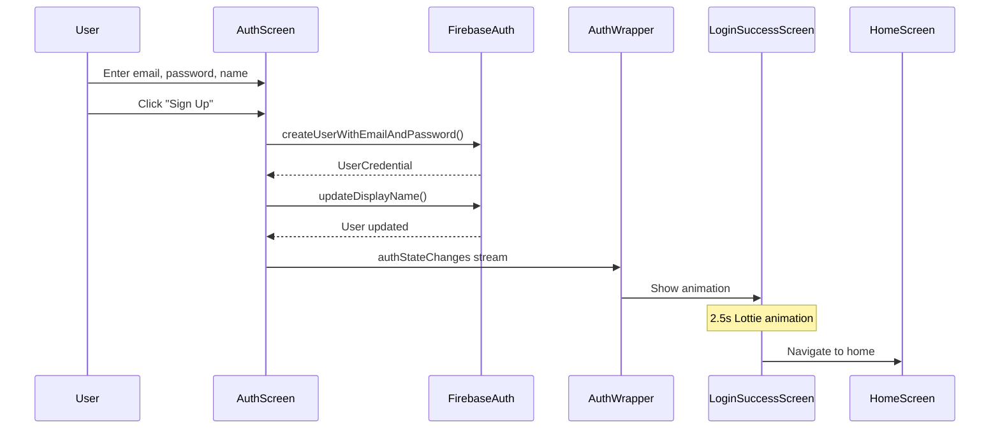
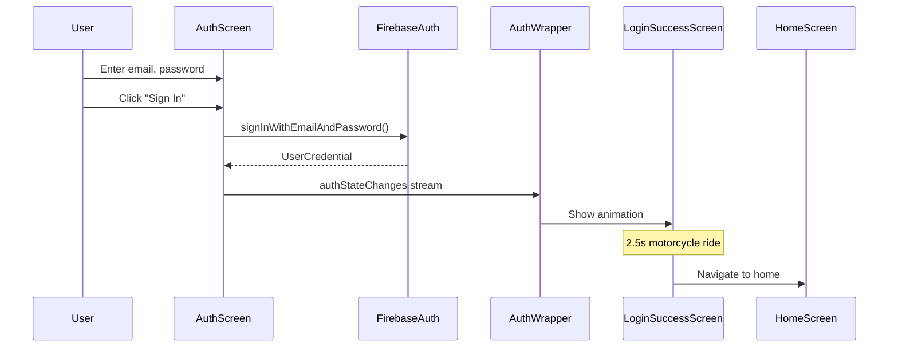

# MotoDocs AI - Flutter Web Application
## Technical Documentation

**Version:** 1.0.0
**Last Updated:** October 2, 2025
**Platform:** Flutter Web (Chrome)

---

## Table of Contents

1. [Project Overview](#project-overview)
2. [Architecture](#architecture)
3. [Technology Stack](#technology-stack)
4. [Project Structure](#project-structure)
5. [Key Features](#key-features)
6. [Authentication Flow](#authentication-flow)
7. [State Management](#state-management)
8. [API Integration](#api-integration)
9. [UI/UX Implementation](#uiux-implementation)
10. [Setup & Installation](#setup--installation)
11. [Configuration](#configuration)
12. [Development Workflow](#development-workflow)
13. [Testing Strategy](#testing-strategy)
14. [Deployment](#deployment)
15. [Troubleshooting](#troubleshooting)

---

## Project Overview

MotoDocs AI is a Flutter web application that provides AI-powered motorcycle documentation assistance powered by a RAG (Retrieval-Augmented Generation) backend. The application focuses exclusively on Harley-Davidson motorcycles, offering intelligent diagnostic suggestions based on uploaded service manuals.

### Core Functionality

- **Firebase Authentication**: Secure email/password authentication
- **Document Management**: Upload and manage motorcycle service manuals (PDF)
- **AI Chat Interface**: Interactive chat for motorcycle diagnostics
- **RAG-Powered Responses**: Contextual answers with confidence scoring
- **Service Manual Verification**: Visual badges for high-confidence responses
- **Animated UI**: Lottie animations for enhanced user experience

---

## Architecture

### High-Level Architecture

```
┌─────────────────────────────────────────────────┐
│           Flutter Web Application               │
│                 (Dart/Flutter)                  │
├─────────────────────────────────────────────────┤
│                                                 │
│  ┌─────────────┐  ┌──────────────┐            │
│  │   Screens   │  │   Services   │            │
│  │             │  │              │            │
│  │ - Auth      │  │ - Auth       │            │
│  │ - Home      │  │ - API        │            │
│  │ - Chat      │  │              │            │
│  │ - Documents │  │              │            │
│  └─────────────┘  └──────────────┘            │
│         │                 │                    │
│         └────────┬────────┘                    │
│                  │                             │
│         ┌────────▼────────┐                    │
│         │   Provider      │                    │
│         │ State Management│                    │
│         └────────┬────────┘                    │
│                  │                             │
└──────────────────┼─────────────────────────────┘
                   │
        ┌──────────▼──────────┐
        │   External Services │
        │                     │
        │ - Firebase Auth     │
        │ - FastAPI Backend   │
        │ - GCP Services      │
        └─────────────────────┘
```

### Application Flow

1. **Initial Load** → SplashScreen → AuthWrapper
2. **Authentication** → AuthScreen → Firebase Auth
3. **Login Animation** → LoginSuccessScreen (2.5s Lottie animation)
4. **Main App** → HomeScreen with tabbed interface
5. **Document Upload** → API call → Backend processing
6. **AI Chat** → Query → RAG Backend → Structured Response

---

## Technology Stack

### Frontend Framework
- **Flutter SDK**: ^3.9.0
- **Dart**: ^3.9.0

### Firebase Integration
- **firebase_core**: ^4.1.1
- **firebase_auth**: ^6.1.0

### State Management
- **provider**: ^6.1.5+1

### HTTP & API
- **http**: ^1.5.0
- **dio**: ^5.9.0 (advanced HTTP client with interceptors)

### UI Components
- **cupertino_icons**: ^1.0.8
- **lottie**: ^3.2.1 (animated graphics)

### File Handling
- **file_picker**: ^10.3.3 (PDF upload)

### Platform
- **Flutter Web** (Chrome browser target)
- **Material Design 3** (Material You)

---

## Project Structure

```
motodocs_web/
├── lib/
│   ├── main.dart                    # App entry point, AuthWrapper
│   ├── firebase_options.dart        # Firebase configuration
│   │
│   ├── screens/                     # UI Screens
│   │   ├── auth_screen.dart        # Login/Signup UI
│   │   ├── splash_screen.dart      # Loading screen
│   │   ├── login_success_screen.dart  # Post-login animation
│   │   ├── home_screen.dart        # Main tabbed interface
│   │   ├── ai_chat_screen.dart     # Chat interface
│   │   └── documents_screen.dart   # Document management
│   │
│   └── services/                    # Business Logic
│       ├── auth_service.dart       # Firebase authentication
│       └── api_service.dart        # Backend API communication
│
├── assets/
│   └── animations/                  # Lottie JSON files
│       ├── motorcycle.json         # Login page animation
│       └── motorcycle_ride.json    # Success animation
│
├── web/                             # Web-specific files
│   ├── index.html                  # HTML entry point
│   └── manifest.json               # PWA configuration
│
├── pubspec.yaml                     # Dependencies
├── analysis_options.yaml           # Linter rules
└── TECHNICAL_DOCUMENTATION.md      # This file
```

---

## Key Features

### 1. **Authentication System**

**Location:** `lib/services/auth_service.dart`, `lib/screens/auth_screen.dart`

#### Features:
- Email/password authentication with Firebase
- Sign-in and sign-up flows
- Real-time authentication state monitoring
- Automatic token refresh
- Session persistence

#### Implementation:
```dart
class AuthService extends ChangeNotifier {
  final FirebaseAuth _firebaseAuth = FirebaseAuth.instance;

  Stream<User?> get authStateChanges => _firebaseAuth.authStateChanges();

  Future<User?> signInWithEmailAndPassword({
    required String email,
    required String password,
  }) async {
    final credential = await _firebaseAuth.signInWithEmailAndPassword(
      email: email,
      password: password,
    );
    notifyListeners();
    return credential.user;
  }
}
```

#### Error Handling:
- `user-not-found`: No account with email
- `wrong-password`: Incorrect password
- `email-already-in-use`: Email already registered
- `weak-password`: Password too weak
- `invalid-email`: Invalid email format
- Network errors with user-friendly messages

---

### 2. **Login Animation System**

**Location:** `lib/screens/login_success_screen.dart`, `lib/main.dart`

#### Flow:
1. User completes authentication
2. AuthWrapper detects user state change
3. Shows `LoginSuccessScreen` with Lottie animation
4. Displays "Welcome to MotoDocs AI!" and "Starting your engine..."
5. After 2.5 seconds, navigates to `HomeScreen`

#### Implementation:
```dart
class LoginSuccessScreen extends StatefulWidget {
  @override
  void initState() {
    super.initState();
    Future.delayed(const Duration(milliseconds: 2500), () {
      if (mounted) {
        Navigator.of(context).pushReplacement(
          MaterialPageRoute(builder: (_) => const HomeScreen()),
        );
      }
    });
  }

  @override
  Widget build(BuildContext context) {
    return Scaffold(
      backgroundColor: Colors.black87,
      body: Center(
        child: Lottie.asset('assets/animations/motorcycle_ride.json'),
      ),
    );
  }
}
```

---

### 3. **AI Chat Interface**

**Location:** `lib/screens/ai_chat_screen.dart`

#### Features:
- Real-time chat with AI assistant
- Bike model filtering
- Structured RAG responses with:
  - Diagnosis
  - Repair steps
  - Safety warnings
  - Required parts
  - Source document references
- Confidence scoring with visual indicators
- "Verified by Service Manual" badge (>50% confidence)

#### Response Formatting:
```dart
String _formatRagResponse(Map<String, dynamic> result) {
  StringBuffer buffer = StringBuffer();

  // Diagnosis
  buffer.writeln('📋 DIAGNOSIS:');
  buffer.writeln(result['diagnosis']);

  // Steps
  buffer.writeln('🔧 REPAIR STEPS:');
  for (int i = 0; i < steps.length; i++) {
    buffer.writeln('${i + 1}. ${steps[i]}');
  }

  // Risks
  buffer.writeln('⚠️ SAFETY WARNINGS:');
  for (var risk in risks) {
    buffer.writeln('• $risk');
  }

  // Parts
  buffer.writeln('🔩 REQUIRED PARTS:');
  for (var part in parts) {
    buffer.writeln('• $part');
  }

  // References
  buffer.writeln('📚 REFERENCES:');
  for (var ref in refs) {
    buffer.writeln('• Doc ID: ${ref['doc_id']}');
  }

  return buffer.toString();
}
```

#### UI Components:
- Message bubbles (user vs AI)
- Confidence percentage display
- Verification badge
- Avatar icons
- Auto-scroll to latest message

---

### 4. **Document Management**

**Location:** `lib/screens/documents_screen.dart`

#### Features:
- Upload PDF documents via file picker
- Display document list with metadata
- Document status indicators (processing, indexed)
- Server-sent events (SSE) for real-time updates
- Document deletion

#### Upload Flow:
```dart
Future<void> _uploadDocument() async {
  final result = await FilePicker.platform.pickFiles(
    type: FileType.custom,
    allowedExtensions: ['pdf'],
  );

  if (result != null) {
    final file = result.files.first;
    final token = await authService.getIdToken();

    await apiService.uploadDocument(
      file: file,
      token: token,
    );
  }
}
```

#### Real-time Updates:
- SSE connection to `/api/v1/sse/events`
- Automatic reconnection on disconnection
- Event types: `document_status_update`, `processing_error`

---

### 5. **API Service**

**Location:** `lib/services/api_service.dart`

#### Endpoints:
| Method | Endpoint | Purpose |
|--------|----------|---------|
| GET | `/api/v1/documents` | Fetch all documents |
| POST | `/api/v1/documents` | Upload document |
| DELETE | `/api/v1/documents/{id}` | Delete document |
| POST | `/api/v1/suggest` | Get AI diagnostic suggestion |
| GET | `/api/v1/sse/events` | Server-sent events stream |

#### Authentication:
```dart
class ApiService {
  String? _authToken;

  void setAuthToken(String token) {
    _authToken = token;
  }

  Map<String, String> _getHeaders() {
    return {
      'Content-Type': 'application/json',
      if (_authToken != null) 'Authorization': 'Bearer $_authToken',
    };
  }
}
```

#### Error Handling:
- Network timeouts (30 seconds)
- HTTP status codes (400, 401, 403, 404, 500)
- JSON parsing errors
- User-friendly error messages

---

## Authentication Flow

### Registration Flow



### Login Flow



---

## State Management

### Provider Architecture

**Location:** `lib/main.dart`

```dart
MultiProvider(
  providers: [
    ChangeNotifierProvider(create: (_) => AuthService()),
    Provider(create: (_) => ApiService()),
  ],
  child: MaterialApp(...),
)
```

### AuthService State

**Responsibilities:**
- Manage Firebase authentication state
- Provide user information
- Handle sign-in/sign-up/sign-out
- Token management

**Usage:**
```dart
// Access in widgets
final authService = context.read<AuthService>();
final user = context.watch<AuthService>().currentUser;

// Listen to auth changes
StreamBuilder(
  stream: authService.authStateChanges,
  builder: (context, snapshot) {
    if (snapshot.hasData) {
      return HomeScreen();
    }
    return AuthScreen();
  },
);
```

---

## API Integration

### Base Configuration

**Location:** `lib/services/api_service.dart`

```dart
class ApiService {
  static const String baseUrl = 'http://localhost:8000';
  late Dio _dio;

  ApiService() {
    _dio = Dio(
      BaseOptions(
        baseUrl: baseUrl,
        connectTimeout: const Duration(seconds: 60),
        receiveTimeout: const Duration(seconds: 60),
      ),
    );
  }

  // Set authentication token for all requests
  void setAuthToken(String token) {
    _dio.options.headers['Authorization'] = 'Bearer $token';
  }

  // Clear authentication token
  void clearAuthToken() {
    _dio.options.headers.remove('Authorization');
  }
}
```

### API Endpoints Reference

| Method | Endpoint | Purpose | Auth Required |
|--------|----------|---------|---------------|
| GET | `/healthz` | Health check | No |
| GET | `/version` | Backend version info | No |
| GET | `/api/v1/documents/` | List all documents | Yes |
| POST | `/api/v1/documents/` | Create document metadata | Yes |
| GET | `/api/v1/documents/{id}` | Get document details | Yes |
| GET | `/api/v1/documents/{id}/status` | Get document status | Yes |
| POST | `/api/v1/documents/upload` | Upload document file | Yes |
| DELETE | `/api/v1/documents/{id}` | Delete document | Yes |
| POST | `/api/v1/suggest` | Get AI diagnostic suggestion | Yes |
| POST | `/api/admin/ingest/{id}` | Trigger document ingestion | Yes (Admin) |

---

### 1. Health Check

**Endpoint:** `GET /healthz`

**Purpose:** Verify backend is running and responsive

**Flutter Implementation:**
```dart
Future<Map<String, dynamic>> healthCheck() async {
  try {
    final response = await _dio.get('/healthz');
    return response.data;
  } catch (e) {
    throw Exception('Health check failed: $e');
  }
}
```

**Usage Example:**
```dart
final apiService = Provider.of<ApiService>(context, listen: false);
try {
  final health = await apiService.healthCheck();
  print('Backend status: ${health['status']}');
} catch (e) {
  print('Backend is down: $e');
}
```

**Response:**
```json
{
  "status": "ok",
  "timestamp": "2025-10-02T05:00:00Z"
}
```

---

### 2. Get Backend Version

**Endpoint:** `GET /version`

**Purpose:** Get backend version and build information

**Flutter Implementation:**
```dart
Future<Map<String, dynamic>> getBackendVersion() async {
  try {
    final response = await _dio.get('/version');
    return response.data;
  } catch (e) {
    throw Exception('Failed to get backend version: $e');
  }
}
```

**Usage Example:**
```dart
final version = await apiService.getBackendVersion();
print('Backend version: ${version['version']}');
print('Build date: ${version['build_date']}');
```

**Response:**
```json
{
  "version": "1.0.0",
  "build_date": "2025-10-01",
  "environment": "production"
}
```

---

### 3. List All Documents

**Endpoint:** `GET /api/v1/documents/`

**Purpose:** Retrieve all documents for authenticated user

**Flutter Implementation:**
```dart
Future<List<Document>> getDocuments() async {
  try {
    final response = await _dio.get('/api/v1/documents/');
    final List<dynamic> documentsJson = response.data['documents'] ?? [];
    return documentsJson.map((json) => Document.fromJson(json)).toList();
  } catch (e) {
    throw Exception('Failed to fetch documents: $e');
  }
}
```

**Usage Example:**
```dart
final authService = Provider.of<AuthService>(context, listen: false);
final apiService = Provider.of<ApiService>(context, listen: false);

// Set auth token
final token = await authService.getIdToken();
apiService.setAuthToken(token!);

// Fetch documents
final documents = await apiService.getDocuments();
for (var doc in documents) {
  print('Document: ${doc.name} - Status: ${doc.status}');
}
```

**Response:**
```json
{
  "documents": [
    {
      "id": "doc_abc123",
      "name": "Softail Service Manual 2020",
      "source_uri": "gs://bucket/raw/doc_abc123.pdf",
      "mime_type": "application/pdf",
      "bike_models": ["Harley-Davidson Softail"],
      "components": ["engine", "transmission"],
      "tags": ["official", "2020"],
      "visibility": "public",
      "status": "INDEXED",
      "progress_percentage": 100,
      "progress_message": "Indexing complete",
      "error": null,
      "created_at": "2025-10-01T10:00:00Z",
      "updated_at": "2025-10-01T10:05:30Z"
    }
  ],
  "total": 1
}
```

---

### 4. Create Document Metadata

**Endpoint:** `POST /api/v1/documents/`

**Purpose:** Create document metadata entry (before upload)

**Flutter Implementation:**
```dart
Future<Document> createDocument({
  required String name,
  required String mimeType,
  required List<String> bikeModels,
  required List<String> components,
  required List<String> tags,
  String visibility = 'public',
}) async {
  try {
    final response = await _dio.post(
      '/api/v1/documents/',
      data: {
        'name': name,
        'mime_type': mimeType,
        'bike_models': bikeModels,
        'components': components,
        'tags': tags,
        'visibility': visibility,
      },
    );
    return Document.fromJson(response.data);
  } catch (e) {
    throw Exception('Failed to create document: $e');
  }
}
```

**Request Body:**
```json
{
  "name": "Sportster Service Manual 2021",
  "mime_type": "application/pdf",
  "bike_models": ["Harley-Davidson Sportster"],
  "components": ["engine", "electrical"],
  "tags": ["official", "2021", "sportster"],
  "visibility": "public"
}
```

**Response:**
```json
{
  "id": "doc_xyz789",
  "name": "Sportster Service Manual 2021",
  "source_uri": "",
  "mime_type": "application/pdf",
  "bike_models": ["Harley-Davidson Sportster"],
  "components": ["engine", "electrical"],
  "tags": ["official", "2021", "sportster"],
  "visibility": "public",
  "status": "CREATED",
  "created_at": "2025-10-02T08:00:00Z",
  "updated_at": "2025-10-02T08:00:00Z"
}
```

---

### 5. Upload Document File

**Endpoint:** `POST /api/v1/documents/upload`

**Purpose:** Upload PDF document with metadata

**Flutter Implementation:**
```dart
import 'dart:html' as html;

Future<Map<String, dynamic>> uploadDocument({
  required html.File file,
  required String name,
  required List<String> bikeModels,
  required List<String> components,
  required List<String> tags,
  String visibility = 'public',
}) async {
  try {
    // Read file bytes for Flutter web
    final fileBytes = await _readFileAsBytes(file);

    FormData formData = FormData.fromMap({
      'file': MultipartFile.fromBytes(fileBytes, filename: file.name),
      'name': name,
      'bike_models': bikeModels.join(','),
      'components': components.join(','),
      'tags': tags.join(','),
      'visibility': visibility,
    });

    final response = await _dio.post(
      '/api/v1/documents/upload',
      data: formData,
    );
    return response.data;
  } catch (e) {
    throw Exception('Failed to upload document: $e');
  }
}

// Helper method to read file as bytes in Flutter web
Future<List<int>> _readFileAsBytes(html.File file) async {
  final completer = Completer<List<int>>();
  final reader = html.FileReader();

  reader.onLoad.listen((e) {
    final result = reader.result;
    if (result is List<int>) {
      completer.complete(result);
    }
  });

  reader.onError.listen((e) {
    completer.completeError('Error reading file: $e');
  });

  reader.readAsArrayBuffer(file);
  return completer.future;
}
```

**Complete Usage Example:**
```dart
import 'package:file_picker/file_picker.dart';
import 'dart:html' as html;

Future<void> uploadServiceManual(BuildContext context) async {
  final apiService = Provider.of<ApiService>(context, listen: false);
  final authService = Provider.of<AuthService>(context, listen: false);

  // Set auth token
  final token = await authService.getIdToken();
  apiService.setAuthToken(token!);

  // Pick file using file_picker
  final result = await FilePicker.platform.pickFiles(
    type: FileType.custom,
    allowedExtensions: ['pdf'],
  );

  if (result != null && result.files.isNotEmpty) {
    final platformFile = result.files.first;

    // Get html.File for web
    final bytes = platformFile.bytes;
    final blob = html.Blob([bytes], 'application/pdf');
    final file = html.File([blob], platformFile.name);

    try {
      final response = await apiService.uploadDocument(
        file: file,
        name: 'Harley-Davidson Service Manual',
        bikeModels: ['Harley-Davidson Softail', 'Harley-Davidson Street Glide'],
        components: ['engine', 'transmission', 'electrical'],
        tags: ['official', '2020', 'service-manual'],
        visibility: 'public',
      );

      print('Upload success: ${response['message']}');
      print('Document ID: ${response['document_id']}');
    } catch (e) {
      print('Upload failed: $e');
    }
  }
}
```

**Request (multipart/form-data):**
```
POST /api/v1/documents/upload
Content-Type: multipart/form-data; boundary=----WebKitFormBoundary

------WebKitFormBoundary
Content-Disposition: form-data; name="file"; filename="manual.pdf"
Content-Type: application/pdf

<PDF binary data>
------WebKitFormBoundary
Content-Disposition: form-data; name="name"

Harley-Davidson Service Manual
------WebKitFormBoundary
Content-Disposition: form-data; name="bike_models"

Harley-Davidson Softail,Harley-Davidson Street Glide
------WebKitFormBoundary
Content-Disposition: form-data; name="components"

engine,transmission,electrical
------WebKitFormBoundary
Content-Disposition: form-data; name="tags"

official,2020,service-manual
------WebKitFormBoundary
Content-Disposition: form-data; name="visibility"

public
------WebKitFormBoundary--
```

**Response:**
```json
{
  "message": "Document uploaded successfully and processing started",
  "document_id": "doc_abc123",
  "status": "UPLOADED",
  "processing_started": true
}
```

---

### 6. Get Document Details

**Endpoint:** `GET /api/v1/documents/{id}`

**Purpose:** Get detailed information about a specific document

**Flutter Implementation:**
```dart
Future<Document> getDocument(String docId) async {
  try {
    final response = await _dio.get('/api/v1/documents/$docId');
    return Document.fromJson(response.data);
  } catch (e) {
    throw Exception('Failed to fetch document: $e');
  }
}
```

**Usage Example:**
```dart
try {
  final document = await apiService.getDocument('doc_abc123');
  print('Document name: ${document.name}');
  print('Status: ${document.status}');
  print('Progress: ${document.progressPercentage}%');
  print('Bike models: ${document.bikeModels.join(", ")}');
} catch (e) {
  print('Error: $e');
}
```

**Response:**
```json
{
  "id": "doc_abc123",
  "name": "Softail Service Manual 2020",
  "source_uri": "gs://bucket/raw/doc_abc123.pdf",
  "mime_type": "application/pdf",
  "bike_models": ["Harley-Davidson Softail"],
  "components": ["engine", "transmission"],
  "tags": ["official", "2020"],
  "visibility": "public",
  "status": "PARSING",
  "progress_percentage": 45,
  "progress_message": "Extracting text from pages...",
  "error": null,
  "created_at": "2025-10-01T10:00:00Z",
  "updated_at": "2025-10-01T10:02:15Z"
}
```

---

### 7. Get Document Status

**Endpoint:** `GET /api/v1/documents/{id}/status`

**Purpose:** Get real-time processing status of a document

**Flutter Implementation:**
```dart
Future<Map<String, dynamic>> getDocumentStatus(String docId) async {
  try {
    final response = await _dio.get('/api/v1/documents/$docId/status');
    return response.data;
  } catch (e) {
    throw Exception('Failed to fetch document status: $e');
  }
}
```

**Usage Example (Polling):**
```dart
// Poll status every 2 seconds until indexed
Timer? _statusTimer;

void startStatusPolling(String docId) {
  _statusTimer = Timer.periodic(Duration(seconds: 2), (timer) async {
    try {
      final status = await apiService.getDocumentStatus(docId);

      print('Status: ${status['status']}');
      print('Progress: ${status['progress_percentage']}%');

      if (status['status'] == 'INDEXED' || status['status'] == 'FAILED') {
        timer.cancel();
        print('Processing complete!');
      }
    } catch (e) {
      print('Status check failed: $e');
      timer.cancel();
    }
  });
}

@override
void dispose() {
  _statusTimer?.cancel();
  super.dispose();
}
```

**Response (Processing):**
```json
{
  "id": "doc_abc123",
  "status": "CHUNKING",
  "progress_percentage": 60,
  "progress_message": "Splitting document into chunks...",
  "error": null
}
```

**Response (Complete):**
```json
{
  "id": "doc_abc123",
  "status": "INDEXED",
  "progress_percentage": 100,
  "progress_message": "Document successfully indexed",
  "error": null
}
```

**Response (Error):**
```json
{
  "id": "doc_abc123",
  "status": "FAILED",
  "progress_percentage": 35,
  "progress_message": "Processing failed",
  "error": "Failed to extract text from PDF: Corrupted file"
}
```

---

### 8. Get AI Diagnostic Suggestion (RAG)

**Endpoint:** `POST /api/v1/suggest`

**Purpose:** Get AI-powered diagnostic suggestions based on symptoms

**Flutter Implementation:**
```dart
Future<Map<String, dynamic>> getSuggestion({
  required String query,
  String? bikeModel,
}) async {
  try {
    final response = await _dio.post(
      '/api/v1/suggest',
      data: {
        'symptom': query,
        'bike_model': bikeModel ?? 'Unknown',
        'top_k': 6,
      },
    );
    return response.data;
  } catch (e) {
    throw Exception('Failed to get suggestion: $e');
  }
}
```

**Complete Usage Example:**
```dart
Future<void> getDiagnosticSuggestion(BuildContext context) async {
  final apiService = Provider.of<ApiService>(context, listen: false);
  final authService = Provider.of<AuthService>(context, listen: false);

  // Set auth token
  final token = await authService.getIdToken();
  apiService.setAuthToken(token!);

  // Get suggestion
  try {
    final result = await apiService.getSuggestion(
      query: 'Engine cranks but won\'t start, smells like fuel',
      bikeModel: 'Harley-Davidson Softail',
    );

    // Parse response
    final diagnosis = result['diagnosis'];
    final steps = List<String>.from(result['steps'] ?? []);
    final risks = List<String>.from(result['risks'] ?? []);
    final parts = List<String>.from(result['parts'] ?? []);
    final references = List<dynamic>.from(result['references'] ?? []);
    final confidence = (result['confidence'] ?? 0.0) as double;
    final latencyMs = result['latency_ms'] ?? 0;

    // Display results
    print('Diagnosis: $diagnosis');
    print('Confidence: ${(confidence * 100).toStringAsFixed(1)}%');

    if (confidence > 0.5) {
      print('✓ Verified by Service Manual');
    }

    print('\nRepair Steps:');
    for (int i = 0; i < steps.length; i++) {
      print('${i + 1}. ${steps[i]}');
    }

    print('\nSafety Warnings:');
    for (var risk in risks) {
      print('⚠️  $risk');
    }

    print('\nRequired Parts:');
    for (var part in parts) {
      print('🔩 $part');
    }

    print('\nSource Documents:');
    for (var ref in references) {
      print('📄 ${ref['doc_id']} (Pages: ${ref['page_spans'].join(", ")})');
    }

    print('\nResponse time: ${latencyMs}ms');

  } catch (e) {
    print('Error getting suggestion: $e');
  }
}
```

**Request Body:**
```json
{
  "symptom": "Engine cranks but won't start, smells like fuel",
  "bike_model": "Harley-Davidson Softail",
  "top_k": 6
}
```

**Response:**
```json
{
  "diagnosis": "The engine is likely flooded with fuel due to over-priming or a stuck fuel injector. The strong fuel smell indicates excess fuel in the combustion chamber preventing ignition.",
  "steps": [
    "Turn off the fuel petcock and wait 5 minutes to allow fuel to evaporate",
    "Remove spark plugs and inspect for fuel fouling",
    "Clean or replace fouled spark plugs",
    "Check fuel injector operation and fuel pressure regulator",
    "Attempt to start engine with throttle fully open to clear flooding",
    "If problem persists, inspect for faulty fuel pressure regulator or injector seals"
  ],
  "risks": [
    "Risk of fire when working with fuel system - ensure no open flames",
    "Fuel vapors are toxic - work in well-ventilated area",
    "Battery sparks can ignite fuel vapors - disconnect battery before fuel system work",
    "High pressure fuel system - relieve pressure before disconnecting fuel lines"
  ],
  "parts": [
    "Spark plugs (HD Part #32362-04)",
    "Fuel injector O-rings (HD Part #27569-01)",
    "Fuel pressure regulator (if faulty)"
  ],
  "references": [
    {
      "doc_id": "softail_service_manual_2020",
      "chunk_id": "chunk_245",
      "page_spans": [156, 157],
      "confidence": 0.89,
      "text_snippet": "Flooded Engine: If engine is flooded with fuel..."
    },
    {
      "doc_id": "softail_service_manual_2020",
      "chunk_id": "chunk_312",
      "page_spans": [203, 204],
      "confidence": 0.82,
      "text_snippet": "Fuel Injection System Diagnosis..."
    }
  ],
  "confidence": 0.85,
  "latency_ms": 1450
}
```

**Error Response (400 - Validation Error):**
```json
{
  "detail": [
    {
      "type": "missing",
      "loc": ["body", "symptom"],
      "msg": "Field required",
      "input": {}
    }
  ]
}
```

**Error Response (401 - Unauthorized):**
```json
{
  "detail": "Invalid authentication credentials"
}
```

---

### 9. Delete Document

**Endpoint:** `DELETE /api/v1/documents/{id}`

**Purpose:** Delete a document and all associated data

**Flutter Implementation:**
```dart
Future<void> deleteDocument(String docId) async {
  try {
    await _dio.delete('/api/v1/documents/$docId');
  } catch (e) {
    throw Exception('Failed to delete document: $e');
  }
}
```

**Usage Example:**
```dart
Future<void> deleteDocumentWithConfirmation(
  BuildContext context,
  String docId,
  String docName,
) async {
  final apiService = Provider.of<ApiService>(context, listen: false);

  // Show confirmation dialog
  final confirm = await showDialog<bool>(
    context: context,
    builder: (context) => AlertDialog(
      title: Text('Delete Document'),
      content: Text('Are you sure you want to delete "$docName"?'),
      actions: [
        TextButton(
          onPressed: () => Navigator.pop(context, false),
          child: Text('Cancel'),
        ),
        TextButton(
          onPressed: () => Navigator.pop(context, true),
          child: Text('Delete', style: TextStyle(color: Colors.red)),
        ),
      ],
    ),
  );

  if (confirm == true) {
    try {
      await apiService.deleteDocument(docId);

      ScaffoldMessenger.of(context).showSnackBar(
        SnackBar(content: Text('Document deleted successfully')),
      );

      // Refresh document list
      // ... refresh logic
    } catch (e) {
      ScaffoldMessenger.of(context).showSnackBar(
        SnackBar(
          content: Text('Failed to delete document: $e'),
          backgroundColor: Colors.red,
        ),
      );
    }
  }
}
```

**Response:**
```
204 No Content
```

**Error Response (404):**
```json
{
  "detail": "Document not found"
}
```

---

### 10. Admin: Trigger Document Ingestion

**Endpoint:** `POST /api/admin/ingest/{id}`

**Purpose:** Manually trigger ingestion pipeline for a document (admin only)

**Flutter Implementation:**
```dart
Future<Map<String, dynamic>> ingestDocument(String docId) async {
  try {
    final response = await _dio.post('/api/admin/ingest/$docId');
    return response.data;
  } catch (e) {
    throw Exception('Failed to ingest document: $e');
  }
}
```

**Usage Example (Admin Panel):**
```dart
Future<void> retryDocumentIngestion(String docId) async {
  final apiService = Provider.of<ApiService>(context, listen: false);

  try {
    final result = await apiService.ingestDocument(docId);

    print('Ingestion started: ${result['message']}');
    print('Task ID: ${result['task_id']}');

    // Start polling status
    startStatusPolling(docId);

  } catch (e) {
    print('Failed to start ingestion: $e');
  }
}
```

**Response:**
```json
{
  "message": "Ingestion pipeline started",
  "document_id": "doc_abc123",
  "task_id": "task_xyz789",
  "status": "PROCESSING"
}
```

---

### Error Handling

**Common HTTP Status Codes:**

| Code | Meaning | Example |
|------|---------|---------|
| 200 | OK | Successful GET/POST |
| 201 | Created | Document created |
| 204 | No Content | Successful DELETE |
| 400 | Bad Request | Invalid request body |
| 401 | Unauthorized | Missing/invalid auth token |
| 403 | Forbidden | Insufficient permissions |
| 404 | Not Found | Document doesn't exist |
| 422 | Validation Error | Invalid field values |
| 500 | Server Error | Backend error |

**Global Error Handler (Dio Interceptor):**
```dart
class ErrorInterceptor extends Interceptor {
  @override
  void onError(DioException err, ErrorInterceptorHandler handler) {
    String message;

    switch (err.response?.statusCode) {
      case 400:
        message = 'Invalid request';
        break;
      case 401:
        message = 'Authentication failed - please login again';
        break;
      case 403:
        message = 'You don\'t have permission to perform this action';
        break;
      case 404:
        message = 'Resource not found';
        break;
      case 422:
        final errors = err.response?.data['detail'];
        message = 'Validation error: ${errors[0]['msg']}';
        break;
      case 500:
        message = 'Server error - please try again later';
        break;
      default:
        message = 'Network error: ${err.message}';
    }

    throw Exception(message);
  }
}

// Add to ApiService constructor
ApiService() {
  _dio = Dio(BaseOptions(baseUrl: baseUrl));
  _dio.interceptors.add(ErrorInterceptor());
}
```

---

## UI/UX Implementation

### Design System

**Color Scheme:**
- Primary: `Colors.blue.shade700`
- Secondary: `Colors.indigo.shade900`
- Success: `Colors.green`
- Error: `Colors.red`
- Background: Gradient (blue → indigo)

**Typography:**
- Headings: Bold, 24-36px
- Body: Regular, 14-16px
- Captions: 10-12px

**Spacing:**
- Small: 8px
- Medium: 16px
- Large: 24px
- XLarge: 32px

### Responsive Design

```dart
final isWideScreen = MediaQuery.of(context).size.width > 600;

// Conditional sizing
final fontSize = isWideScreen ? 36 : 28;
final padding = isWideScreen ? 48.0 : 32.0;
```

### Animations

**1. Login Page Animation**
- File: `motorcycle.json`
- Type: Loop
- Size: 120x120 (mobile), 150x150 (desktop)

**2. Success Animation**
- File: `motorcycle_ride.json`
- Type: Play once
- Duration: 2.5 seconds
- Size: 300x300 (mobile), 400x400 (desktop)

---

## Setup & Installation

### Prerequisites

- Flutter SDK 3.9.0 or higher
- Dart 3.9.0 or higher
- Chrome browser
- Firebase project
- MotoDocs Backend running

### Step 1: Clone Repository

```bash
# Assuming the project is in
cd /Users/pauloborges/dev/flutter_projects/motodocs_web
```

### Step 2: Install Dependencies

```bash
flutter pub get
```

### Step 3: Configure Firebase

1. Create Firebase project at https://console.firebase.google.com
2. Enable Email/Password authentication
3. Download `google-services.json` (Android) and `GoogleService-Info.plist` (iOS)
4. Run FlutterFire configuration:

```bash
flutterfire configure
```

### Step 4: Add Lottie Animations

Place animation files in `assets/animations/`:
- `motorcycle.json` (login page)
- `motorcycle_ride.json` (success animation)

### Step 5: Configure API Endpoint

Update `lib/services/api_service.dart`:

```dart
static const String baseUrl = 'http://localhost:8000'; // or production URL
```

### Step 6: Run Application

```bash
flutter run -d chrome
```

---

## Configuration

### Environment Variables

Create `.env` file (not tracked in git):

```env
API_BASE_URL=http://localhost:8000
ENABLE_DEBUG_LOGGING=true
```

### Firebase Configuration

**Location:** `lib/firebase_options.dart`

Generated by FlutterFire CLI, contains:
- API keys
- Project IDs
- App IDs
- Messaging sender IDs

**Security:** Never commit real Firebase credentials to public repos

### API Configuration

**Location:** `lib/services/api_service.dart`

```dart
class ApiService {
  static const String baseUrl = String.fromEnvironment(
    'API_BASE_URL',
    defaultValue: 'http://localhost:8000',
  );
}
```

---

## Development Workflow

### Code Organization

**Screens:**
- One file per screen
- StatefulWidget for interactive screens
- Dispose controllers in `dispose()`

**Services:**
- Singleton pattern via Provider
- Pure business logic
- No UI code

**Models:**
- Immutable data classes
- JSON serialization
- Validation logic

### Coding Standards

**Dart/Flutter:**
- Follow official Dart style guide
- Use `analysis_options.yaml` linter
- Format with `dart format`

**File Naming:**
- `snake_case` for file names
- `PascalCase` for class names
- `camelCase` for variables/methods

### Git Workflow

```bash
# Feature branch
git checkout -b feature/login-animation

# Make changes
git add .
git commit -m "feat: add login success animation"

# Push
git push origin feature/login-animation

# Create PR
gh pr create --title "Add login animation" --body "..."
```

---

## Testing Strategy

### Unit Tests

**Location:** `test/services/`

```dart
void main() {
  group('AuthService', () {
    test('sign in with valid credentials', () async {
      final authService = AuthService();
      final user = await authService.signInWithEmailAndPassword(
        email: 'test@example.com',
        password: 'password123',
      );
      expect(user, isNotNull);
    });
  });
}
```

### Widget Tests

**Location:** `test/screens/`

```dart
void main() {
  testWidgets('AuthScreen shows login form', (tester) async {
    await tester.pumpWidget(
      MaterialApp(home: AuthScreen()),
    );

    expect(find.text('Email'), findsOneWidget);
    expect(find.text('Password'), findsOneWidget);
    expect(find.text('Sign In'), findsOneWidget);
  });
}
```

### Integration Tests

**Location:** `integration_test/`

```dart
void main() {
  IntegrationTestWidgetsFlutterBinding.ensureInitialized();

  testWidgets('Complete login flow', (tester) async {
    await tester.pumpWidget(MyApp());

    // Enter credentials
    await tester.enterText(
      find.byType(TextField).first,
      'test@example.com',
    );

    // Click sign in
    await tester.tap(find.text('Sign In'));
    await tester.pumpAndSettle();

    // Verify home screen
    expect(find.text('Documents'), findsOneWidget);
  });
}
```

### Run Tests

```bash
# Unit tests
flutter test

# Widget tests
flutter test test/screens/

# Integration tests
flutter test integration_test/
```

---

## Deployment

### Web Deployment

#### Build for Production

```bash
flutter build web --release
```

**Output:** `build/web/`

#### Deploy to Firebase Hosting

```bash
# Install Firebase CLI
npm install -g firebase-tools

# Login
firebase login

# Initialize
firebase init hosting

# Deploy
firebase deploy --only hosting
```

#### Deploy to Netlify

```bash
# Install Netlify CLI
npm install -g netlify-cli

# Login
netlify login

# Deploy
netlify deploy --dir=build/web --prod
```

### Environment-Specific Builds

**Development:**
```bash
flutter build web --dart-define=ENV=development
```

**Staging:**
```bash
flutter build web --dart-define=ENV=staging
```

**Production:**
```bash
flutter build web --dart-define=ENV=production
```

---

## Troubleshooting

### Common Issues

#### 1. Firebase Authentication Errors

**Error:** `[firebase_auth/network-request-failed]`

**Solution:**
- Check internet connection
- Verify Firebase project configuration
- Check CORS settings in Firebase console

#### 2. API Connection Failed

**Error:** `Failed to connect to http://localhost:8000`

**Solution:**
- Ensure backend server is running
- Check `baseUrl` in `ApiService`
- Verify CORS is enabled on backend

#### 3. Lottie Animation Not Loading

**Error:** `Unable to load asset: assets/animations/motorcycle.json`

**Solution:**
- Verify file exists in `assets/animations/`
- Check `pubspec.yaml` includes assets path
- Run `flutter pub get`
- Clean and rebuild: `flutter clean && flutter pub get`

#### 4. Hot Reload Not Working

**Solution:**
```bash
# Kill app and restart
flutter run -d chrome
```

#### 5. Build Errors

**Error:** `Gradle build failed`

**Solution:**
```bash
flutter clean
flutter pub get
flutter build web
```

---

## Performance Optimization

### Image Optimization

- Use WebP format for images
- Lazy load images
- Implement caching

### Code Splitting

```dart
// Lazy load screens
final route = MaterialPageRoute(
  builder: (_) => const HomeScreen(),
);
```

### Network Optimization

- Implement request caching
- Use Dio interceptors for retry logic
- Compress payloads

### State Optimization

- Use `const` constructors
- Implement `shouldRebuild` logic
- Minimize unnecessary rebuilds

---

## Security Considerations

### Authentication

- Use Firebase Admin SDK on backend for token verification
- Never store tokens in localStorage (use Firebase persistence)
- Implement token refresh logic

### API Security

- Always use HTTPS in production
- Validate all user inputs
- Sanitize data before sending to backend

### Data Privacy

- Don't log sensitive data
- Implement proper error handling
- Use environment variables for secrets

---

## Future Enhancements

### Planned Features

1. **Multi-language Support**
   - i18n implementation
   - RTL support

2. **Offline Mode**
   - Local caching with IndexedDB
   - Sync when online

3. **Advanced Search**
   - Full-text search in documents
   - Filter by tags, date, bike model

4. **User Profile**
   - Avatar upload
   - Garage (saved bikes)
   - Favorite documents

5. **Push Notifications**
   - Document processing complete
   - New features announcements

---

## Support & Contact

**Developer:** Paulo Borges
**Email:** paulo@example.com
**Repository:** (Add GitHub URL)
**Backend Documentation:** See `MotoDoc Backend/TECHNICAL_DOCUMENTATION.md`

---

## License

Copyright © 2025 Paulo Borges. All rights reserved.

---

**End of Documentation**
